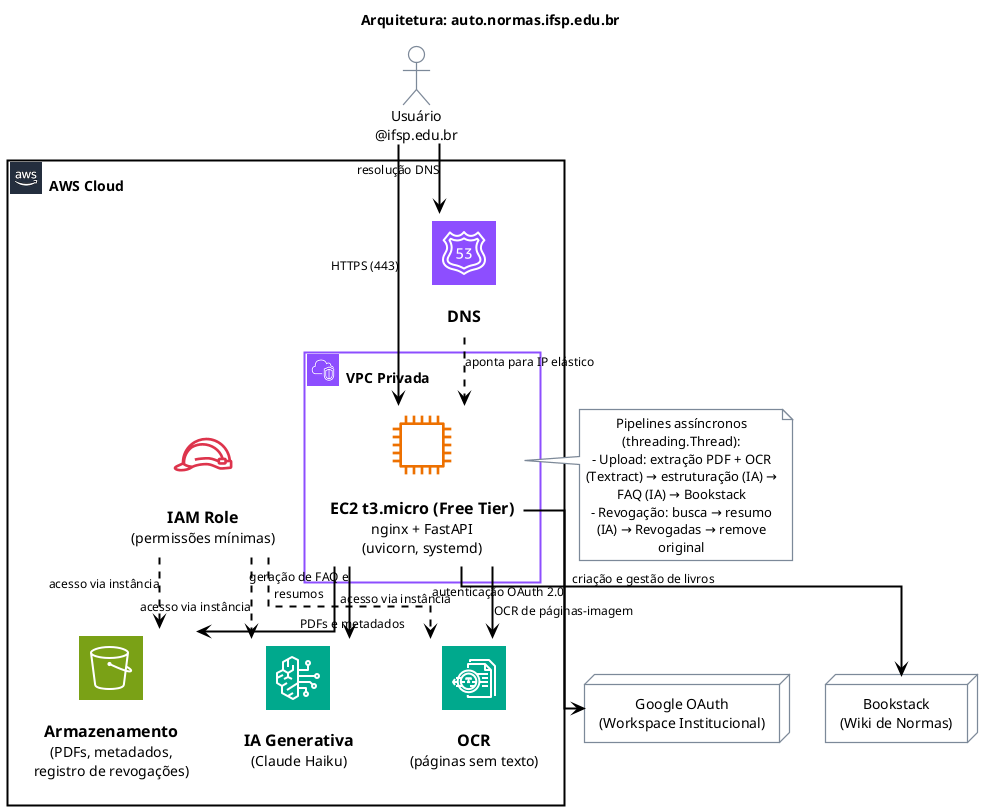

# IFSP Normas — Sistema de Publicação de Normativos

Portal web institucional do **Instituto Federal de Educação, Ciência e Tecnologia de São Paulo** para gestão do ciclo de vida de normativos institucionais: portarias, resoluções, instruções normativas, editais, deliberações e documentos similares.

🔗 **Acesso:** https://auto.normas.ifsp.edu.br

---

## O que o sistema faz

1. Um **operador** envia o PDF do normativo pelo portal
2. O sistema renderiza cada página do PDF como imagem e usa IA (visão computacional) para extrair e estruturar o conteúdo, gerando também um FAQ sobre o documento
3. Um rascunho estruturado é criado no [normas.ifsp.edu.br](https://normas.ifsp.edu.br) (Bookstack) com três seções: Perguntas Frequentes, Texto Completo e link de download
4. Um **revisor** ou **administrador** analisa o rascunho e o publica na prateleira correta, ou o descarta
5. Normativos publicados podem ser **movidos** entre prateleiras ou **revogados**: a IA gera um resumo estruturado e o documento é movido para a prateleira de Revogadas
6. Todas as ações ficam registradas no log de auditoria

---

## Papéis de usuário

| Papel | Quem é | O que pode fazer |
|-------|--------|-----------------|
| **Servidor** | Servidores em geral | Visualizar rascunhos e normativos publicados; consultar log |
| **Operador** | Quem envia documentos | Tudo acima + enviar normativos via upload |
| **Revisor** | Responsáveis pela publicação | Tudo acima + publicar, mover e revogar normativos; excluir rascunhos próprios |
| **Administrador** | Gestores do sistema | Tudo acima + excluir qualquer rascunho/revogado, gerenciar usuários |

O acesso é restrito a contas `@ifsp.edu.br` via Google Workspace. O papel padrão no primeiro login é **Servidor** — um administrador deve promover o usuário se necessário.

---

## Manual de Operação

### Para todos os usuários

**Acesso:**
1. Acesse https://auto.normas.ifsp.edu.br
2. Clique em **Entrar com Google Workspace**
3. Selecione sua conta `@ifsp.edu.br`
   > Se o Google selecionar automaticamente uma conta Gmail pessoal, clique em "Sair do Google" no link indicado na tela de login e tente novamente com sua conta institucional

---

### Papel: Operador — Enviar um normativo

1. Na tela inicial, informe o **título do normativo** (ex: *Portaria IFSP nº 001, de 01 de janeiro de 2025*)
2. Selecione ou arraste o arquivo **PDF**
3. Clique em **Enviar para processamento**
4. Acompanhe o progresso pelas etapas exibidas na tela:
   - **Extração** — cada página do PDF é analisada por IA (visão computacional), que extrai e estrutura o conteúdo em seções e capítulos
   - **FAQ / IA** — uma inteligência artificial gera perguntas frequentes sobre o documento
   - **Bookstack** — o rascunho é criado no portal de normas
   - **Concluído** — link para visualizar o rascunho no Bookstack
5. Ao final, o sistema exibe quantas páginas e caracteres foram extraídos. Avisos em amarelo indicam possíveis problemas na extração ou na numeração dos capítulos

> **Atenção:** o PDF enviado fica armazenado permanentemente, mesmo após revogação do normativo.

> **PDFs idênticos:** se o mesmo arquivo já foi enviado anteriormente, o sistema retorna o upload anterior sem reprocessar.

---

### Papel: Revisor — Publicar um rascunho

1. Acesse o menu **Revisão**
2. Na seção **Rascunhos aguardando revisão**, use a busca por título para localizar o normativo
3. Clique em **Revisar** para abrir o documento no Bookstack e verificar o conteúdo
4. Se o conteúdo estiver correto, clique em **Publicar**, selecione a **prateleira de destino** e confirme
5. Se houver problema no rascunho, clique em **Remover** (revisores podem remover rascunhos enviados por eles mesmos; administradores podem remover qualquer rascunho)

---

### Papel: Revisor — Mover um normativo entre prateleiras

1. Acesse o menu **Revisão**, seção **Normativos publicados**
2. Localize o normativo usando a busca por título ou o filtro por prateleira
3. Clique em **Mover**, selecione a **nova prateleira de destino** e confirme

---

### Papel: Revisor — Revogar um normativo publicado

1. Acesse o menu **Revisão**
2. Na seção **Normativos publicados**, localize o normativo usando a busca por título ou o filtro por prateleira
3. Clique em **Revogar** e confirme
4. O sistema irá:
   - Gerar automaticamente um resumo estruturado (tipo, número, data e objetivo)
   - Criar uma entrada permanente na prateleira **Revogadas** do Bookstack
   - Remover o normativo original do Bookstack
   - Manter o PDF original armazenado com link permanente de download
5. Acompanhe o progresso na barra exibida na tela

---

### Papel: Administrador — Gerenciar usuários

1. Acesse o menu **Usuários**
2. Todos os usuários que já fizeram login aparecem listados com seu papel atual
3. Para alterar o papel, selecione o novo papel no menu ao lado do usuário e clique em **Salvar**
4. A mudança entra em vigor imediatamente, sem necessidade de o usuário fazer logout

> **Papéis disponíveis:** Servidor · Operador · Revisor · Administrador

---

### Papel: Administrador — Consultar o log de auditoria

1. Acesse o menu **Log**
2. O log exibe todas as ações realizadas no sistema em ordem cronológica reversa: uploads, publicações, movimentações, revogações, exclusões e alterações de papel
3. Cada registro mostra data/hora, usuário responsável, tipo de ação e normativo envolvido
4. Use o seletor de mês no topo para navegar pelo histórico — apenas os meses com registros são listados
5. Clique em **Exibir logs técnicos** para ver também eventos de sistema: anomalias de sessão (IP/User-Agent divergente) e erros internos nos pipelines de processamento. Esses registros ficam ocultos por padrão e são visíveis apenas para administradores

---

### Papel: Administrador — Painel de custos Bedrock

1. Acesse o menu **Custo**
2. O painel exibe o custo estimado de uso da IA (Amazon Bedrock), discriminado por tipo de operação:
   - **Extração (Vision)** — leitura e estruturação das páginas do PDF
   - **FAQ** — geração das perguntas frequentes
   - **Revogação** — geração do resumo de normativos revogados
3. Os custos são organizados por ano em seções expansíveis; clique no ano para expandir ou recolher
4. Se a permissão `ce:GetCostAndUsage` estiver configurada no IAM role da EC2, a coluna **Real USD** exibe o valor efetivamente faturado pela AWS (com ~24 h de atraso); caso contrário, apenas a estimativa por token é exibida
5. A cotação USD/BRL é obtida automaticamente; em caso de falha na API, o último valor registrado é exibido com indicação de desatualização
6. Para ajustar os preços por token (necessário após mudanças no modelo ou na tabela da AWS), use o formulário **Configuração de preços** no final da página

> **Atenção:** os preços padrão ($3,00/$15,00 por 1M tokens) são um ponto de partida. Verifique o preço real do modelo em uso no console AWS (**Bedrock → Pricing**) e atualize pela interface para que as estimativas sejam precisas.

---

### Papel: Administrador — Excluir um registro de revogado

1. Acesse o menu **Revisão**, seção **Normativos revogados**
2. Clique em **Remover**, digite `REMOVER` no campo de confirmação e confirme
3. O registro é removido do portal e o PDF original é excluído do armazenamento

> Esta ação é **irreversível**.

---

## Informações técnicas (para técnicos)

### Stack
- **Backend:** Python + FastAPI + Uvicorn
- **Frontend:** Jinja2 + HTMX + Design System GOV.BR
- **Autenticação:** Google OAuth 2.0 — restrito ao Workspace `@ifsp.edu.br`
- **Armazenamento:** AWS S3
- **IA Generativa:** Amazon Bedrock (Claude Sonnet 4.6 — extração por visão, FAQ e resumo de revogação)
- **Wiki:** Bookstack (normas.ifsp.edu.br)
- **Infraestrutura:** AWS EC2 + nginx + Let's Encrypt

### Atualizar o código em produção

```bash
ssh -i ~/.ssh/sua-chave.pem ec2-user@auto.normas.ifsp.edu.br
cd /home/ec2-user/auto-ifsp-normas
git pull
sudo systemctl restart ifsp-normas
```

Para atualizar também o nginx (após mudanças em `nginx/ifsp-normas.conf`):

```bash
sudo cp nginx/ifsp-normas.conf /etc/nginx/conf.d/ifsp-normas.conf
sudo nginx -t && sudo systemctl reload nginx
```

### Monitorar o serviço

```bash
sudo systemctl status ifsp-normas
sudo journalctl -u ifsp-normas -n 100 --no-pager
```

### Revogar todas as sessões em caso de comprometimento

```bash
python3 -c "import secrets; print(secrets.token_hex(32))"
# Substitua SESSION_SECRET_KEY no .env com o valor gerado
sudo systemctl restart ifsp-normas
```

### Ambiente de desenvolvimento local

Consulte o arquivo `.env.example` para as variáveis necessárias. Em desenvolvimento, use as flags `MOCK_AUTH`, `MOCK_BOOKSTACK` e `MOCK_S3` para simular os serviços externos sem custo.

```bash
python3 -m venv .venv && source .venv/bin/activate
pip install -r requirements.txt
# Configure o .env com MOCK_AUTH=true, MOCK_BOOKSTACK=true, MOCK_S3=true
uvicorn app.main:app --reload
```

---

## Diagrama de arquitetura



O diagrama fonte está em `docs/arquitetura.puml` (formato [PlantUML](https://plantuml.com) com ícones oficiais da AWS).

**Para reeditar e regenerar:**

1. Instale a extensão [PlantUML](https://marketplace.visualstudio.com/items?itemName=jebbs.plantuml) no VS Code
2. Instale as bibliotecas de ícones AWS localmente em `docs/plantuml-libs/`:
   ```bash
   mkdir -p docs/plantuml-libs
   cd docs/plantuml-libs
   git clone https://github.com/awslabs/aws-icons-for-plantuml.git
   ```
3. Abra `docs/arquitetura.puml` e pressione `Alt+D`

> As bibliotecas estão no `.gitignore` e precisam ser instaladas localmente por cada colaborador.

---

## Desenvolvido com

Este sistema foi desenvolvido com auxílio do **[Claude Code](https://claude.ai/code)** (Anthropic). O assistente de IA participou de todo o ciclo: arquitetura, implementação, integrações, hardening de segurança e deploy em produção.

---

*Instituto Federal de Educação, Ciência e Tecnologia de São Paulo — [www.ifsp.edu.br](https://www.ifsp.edu.br)*
